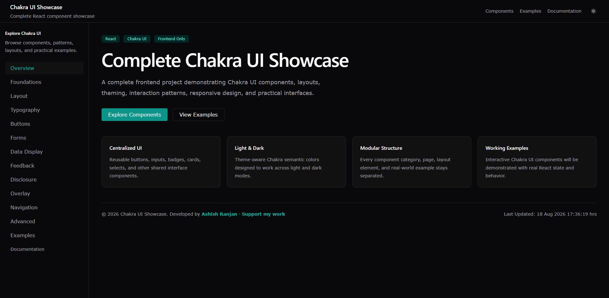

# Chakra UI Showcase

A responsive React showcase for exploring Chakra UI components, layouts, interaction patterns, and practical interface examples.

The project demonstrates Chakra UI through working examples with light and dark themes, reusable application components, responsive navigation, interactive demos, and concise code hints.



## Features

- Light and dark theme support
- Responsive desktop and mobile layouts
- Reusable UI components
- Component-focused live examples
- Code hints alongside selected demos
- Working forms and interactions
- Responsive mobile navigation drawer
- Lazy-loaded application pages
- Custom 404 page
- Official Chakra UI documentation access
- Practical real-world interface examples

## Showcase Sections

- Foundations
- Layout
- Typography
- Buttons
- Forms
- Data Display
- Feedback
- Disclosure
- Overlay
- Navigation
- Advanced
- Real-World Examples

## Tech Stack

- React
- Vite
- Chakra UI
- React Router
- React Icons

## Getting Started

Install the project dependencies:

```bash
npm install
```

Start the development server:

```bash
npm run dev
```

Create a production build:

```bash
npm run build
```

Preview the production build:

```bash
npm run preview
```

## Project Structure

```text
src/
├── components/
│   ├── advanced/
│   ├── buttons/
│   ├── data-display/
│   ├── disclosure/
│   ├── examples/
│   ├── feedback/
│   ├── forms/
│   ├── foundations/
│   ├── layout/
│   ├── layout-showcase/
│   ├── navigation/
│   ├── overlay/
│   ├── typography/
│   └── ui/
├── data/
├── pages/
├── App.jsx
├── index.css
└── main.jsx
```

## Documentation

For complete Chakra UI documentation, visit the official Chakra UI website:

https://chakra-ui.com/docs

## Author

**Ashish Ranjan**

- Portfolio: https://www.ashishranjan.net
- GitHub: https://github.com/a2rp
- CodePen: https://codepen.io/ash1198
- LinkedIn: https://www.linkedin.com/in/aashishranjan
- Facebook: https://www.facebook.com/theash.ashish/
- YouTube: https://www.youtube.com/@ashishranjan-ashz?sub_confirmation=1
- Email: mailto:ash.ranjan09@gmail.com

## Support

- Support: https://a2rp-donation-page.netlify.app/
- Buy Me A Coffee: https://buymeacoffee.com/a2rp
- Patreon: https://patreon.com/a2rp

## License

MIT License

## Links

- Portfolio: [https://www.ashishranjan.net](https://www.ashishranjan.net)
- GitHub: [https://github.com/a2rp](https://github.com/a2rp)
- CodePen: [https://codepen.io/ash1198](https://codepen.io/ash1198)
- LinkedIn: [https://www.linkedin.com/in/aashishranjan](https://www.linkedin.com/in/aashishranjan)
- Facebook: [https://www.facebook.com/theash.ashish/](https://www.facebook.com/theash.ashish/)
- YouTube: [https://www.youtube.com/@ashishranjan-ashz?sub_confirmation=1](https://www.youtube.com/@ashishranjan-ashz?sub_confirmation=1)
- Email: [ash.ranjan09@gmail.com](mailto:ash.ranjan09@gmail.com)

## Support

- Support: [https://a2rp-donation-page.netlify.app/](https://a2rp-donation-page.netlify.app/)
- Buy Me A Coffee: [https://buymeacoffee.com/a2rp](https://buymeacoffee.com/a2rp)
- Patreon: [https://patreon.com/a2rp](https://patreon.com/a2rp)