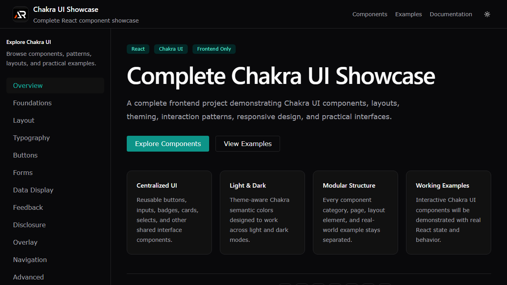

# Chakra UI Showcase

A responsive React showcase for exploring Chakra UI components, layouts, forms, navigation, overlays, themes, and practical interface examples.



## Features

- Organized component examples across common UI categories
- Light and dark themes
- Responsive desktop and mobile navigation
- Working forms, dialogs, drawers, pagination, tables, and examples
- Lazy-loaded pages with a custom not-found page

## Tech stack

- React and Vite
- Chakra UI
- React Router
- React Icons

## Run locally

```bash
npm install
npm run dev
```

Build and deploy to GitHub Pages:

```bash
npm run build
npm run deploy
```

Live app: https://a2rp.github.io/chakra-ui-showcase/

## Links

- Portfolio: https://www.ashishranjan.net/
- GitHub: https://github.com/a2rp
- CodePen: https://codepen.io/ash1198
- LinkedIn: https://www.linkedin.com/in/aashishranjan
- Facebook: https://www.facebook.com/theash.ashish/
- YouTube: https://www.youtube.com/@ashishranjan-ashz?sub_confirmation=1
- Email: mailto:ash.ranjan09@gmail.com

## Support

- Support: https://a2rp-donation-page.netlify.app/
- Buy Me a Coffee: https://buymeacoffee.com/a2rp
- Patreon: https://www.patreon.com/a2rp
